

# Solution [[Version PDF]](pdf/JENKINS1_solution.md.pdf "Ouvrir la version PDF")

# Création d'un projet Maven
- Installer les plugins suivants :
1. Maven integration
2. Parameterized Trigger
3. Delivery Pipeline Plugin

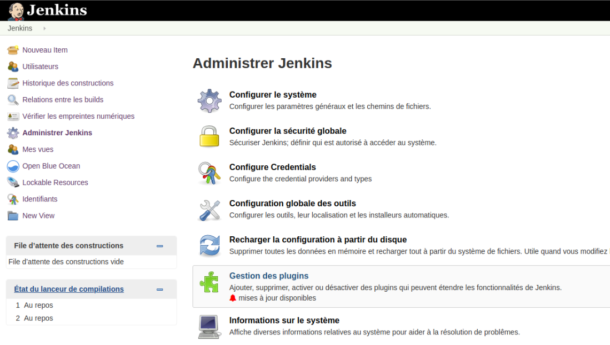

----------

- Cible à atteindre :

 

----------

## Création de l'item "Petclinic_compile"
- Description : cet item se chargera de récupérer les sources du projet sur GitHub et lancera la compilation sous Maven.  
- Nom : Petclinic_compile  
- Type : Projet Maven  

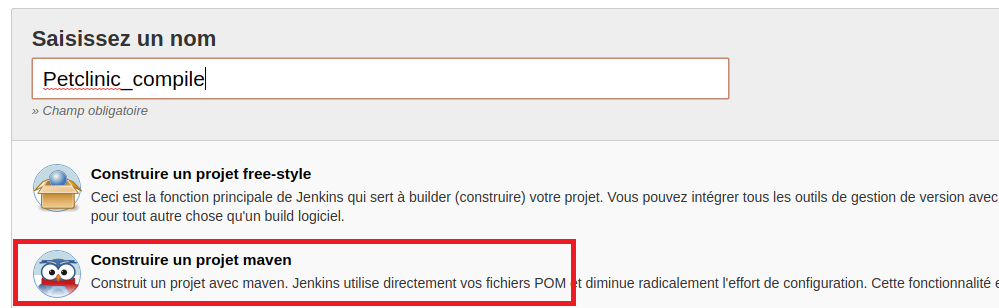

- Actions :  
1. Récupère les sources sur GitHub  

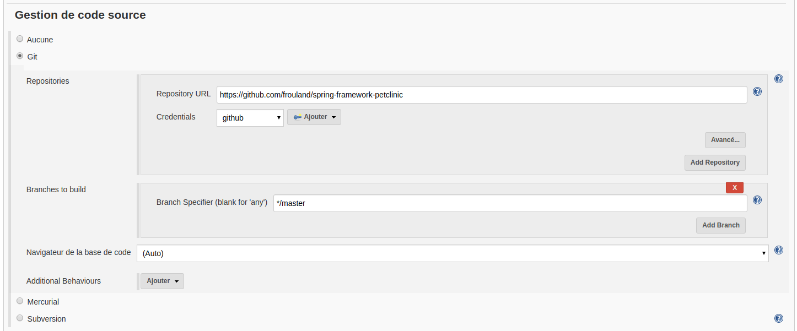

2. Lance la tâche maven "**clean compile**"  

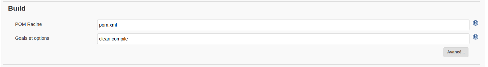

## Création d'une vue de type "Delivery Pipeline View"
- Description : cette vue permmettra d'afficher les enchaînements entre les items.  
- Nom de la vue : Petclinic pipeline  

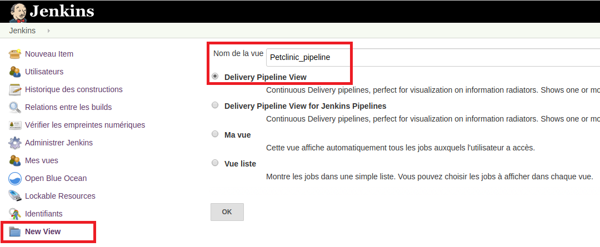

- Dans la zone "**Pipelines**", ajouter un component avec :  
 - Name : Petclinic pipeline  
 - Initial Job : Petclinic\_compile  
 

- Afficher la nouvelle vue  

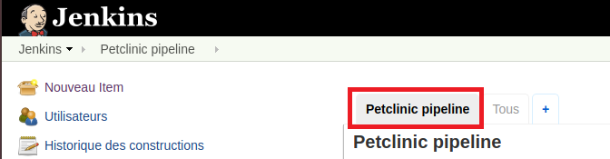

## Création de l'item Petclinic_package
- Description : cet item doit construire le package WAR du projet. Il doit pouvoir utiliser le workspace de l'item précédent.  
- Nom : Petclinic\_package  
- Type : Projet Maven  

- Paramètre string : WORKSPACE\_PARENT  
- Actions :  
1. Prends en paramètre le workspace du build parent (WORKSPACE\_PARENT)  

2. Lance la tâche maven "**package**"  
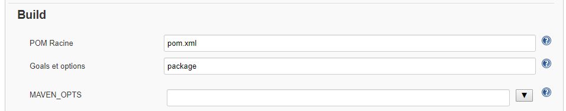

- Dans la section build, spécifier le répertoire de travail spécifique avec la valeur $WORKSPACE\_PARENT  

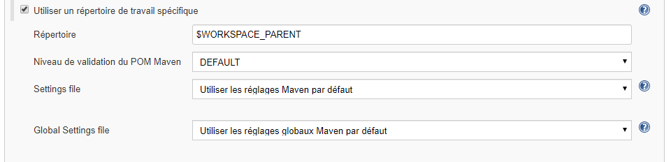

- Modifier l'item "**Petclinic\_compile**" pour ajouter l'appel à l'item "**Petclinic\_package**" après le lancement de la tâche maven "**clean compile**". Initialiser la variable WORKSPACE\_PARENT avec le workspace de l'item "**Petclinic\_compile**" ("**Predefined parameters**" avec le paramètre : **WORKSPACE_PARENT=$WORKSPACE**)

> Astuce : Chaîner les items en utilisant une action "**Trigger parameterized build on other projects**"  

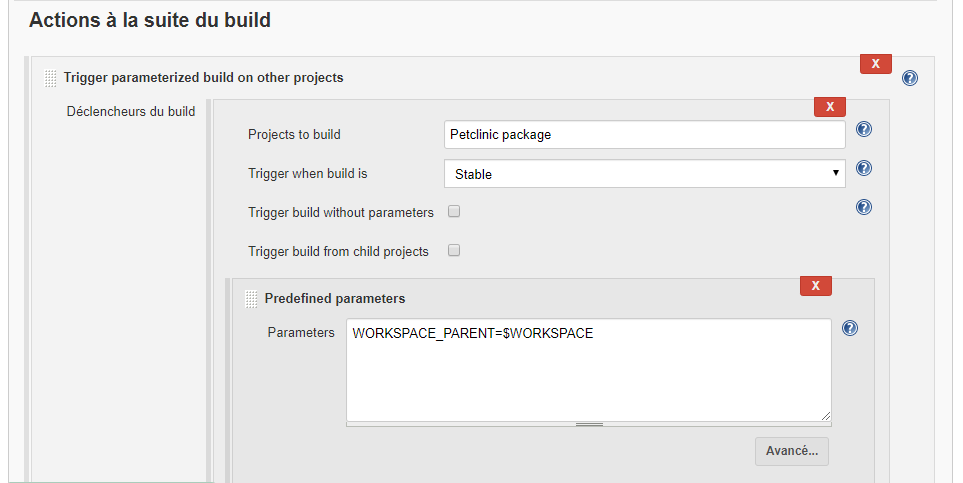

## Création de l'item "Petclinic_deployQualification"
- Description : cet item doit copier le WAR généré dans un répertoitre sur le serveur  
- Nom : Petclinic_deployQualification  
- Type : Projet free-style  

- Paramètre string : WORKSPACE\_PARENT  
- Actions :  
1. Prends en paramètre le workspace du build parent (WORKSPACE\_PARENT)  

2. Copie le fichier "**$WORKSPACE_PARENT/target/petclinic.war**" du workspace dans le répertoire **/var/tmp**

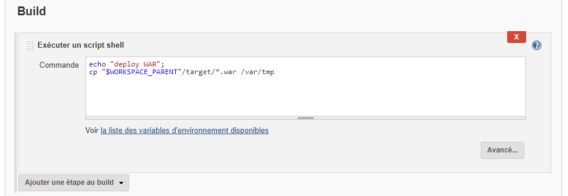

- Modifier l'item "**Petclinic\_package**" pour ajouter l'appel à l'item "**Petclinic\_deployQualification**" après le lancement de la tâche maven "**package**". Initialiser la variable WORKSPACE\_PARENT avec le workspace de l'item "**Petclinic\_package**"  

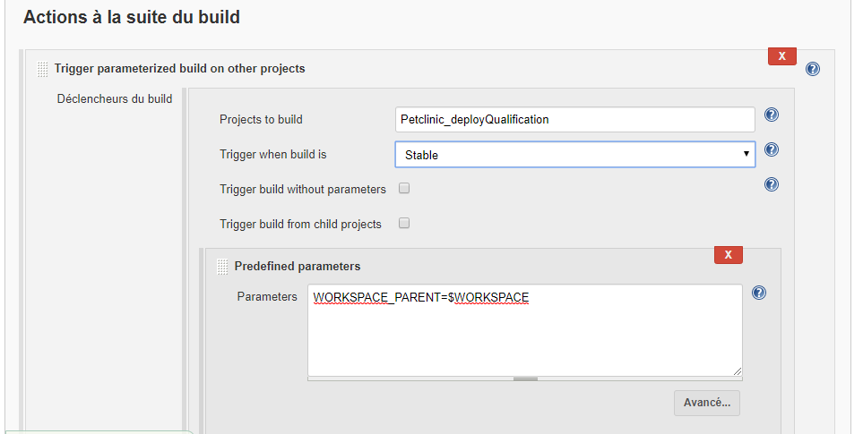

## Lancement du build 
- Lancer le build manuellement et vérifier que le WAR est bien déployé dans le répertoire "**/var/tmp**"  
- Optimiser le démarrage du build en scrutant l'outil de gestion de version toutes les minutes  
> Astuce : Utiliser l'expression * * * * * pour exécuter la tâche toutes les minutes 

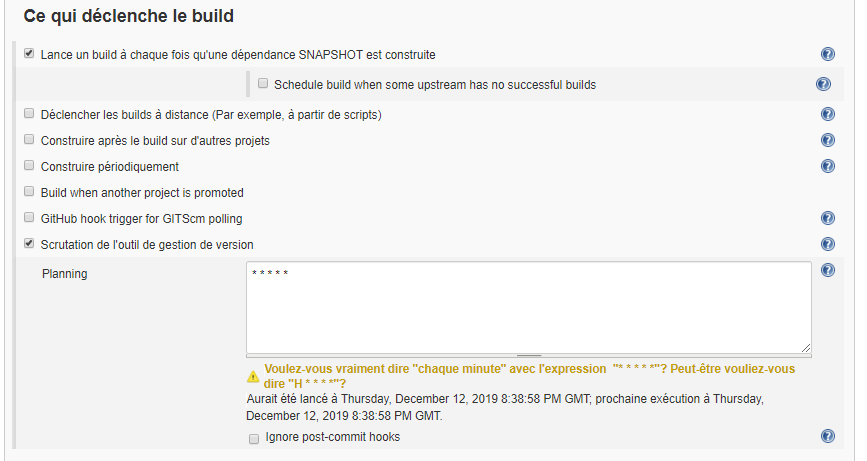

- Faire une modification sur le projet dans GitHub puis un commit  
- Vérifier que le build se lance bien automatiquement  

 
