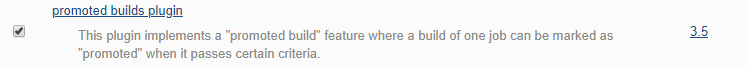
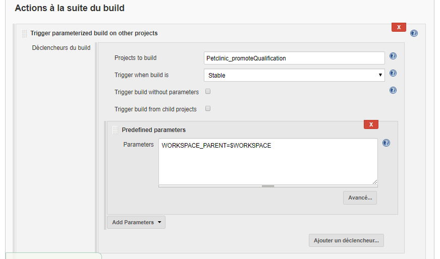
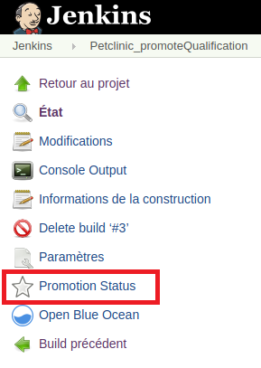
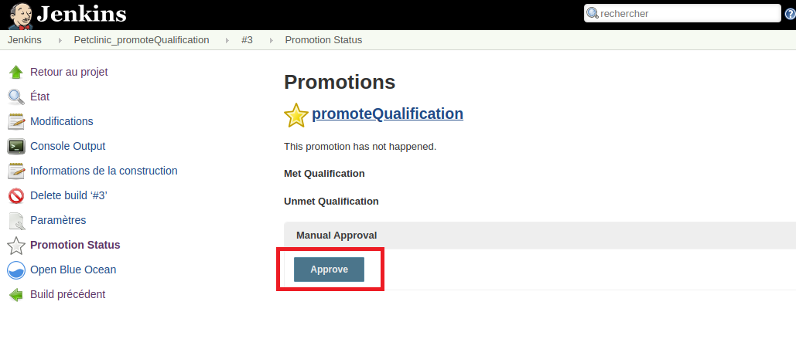

# Solution [[Version PDF]](pdf/OPTION1_solution.md.pdf "Ouvrir la version PDF")

# Utilisation du plugin "promoted builds"
But : utiliser le plugin "**promoted builds**" pour valider manuellement le déploiement sur le serveur de qualification

- Cible à atteindre :

- Installer le plugin "**promoted builds**"
  

## Création de l'item Petclinic_promoteQualification
- Description : cet item doit permettre de stopper la chaine du build après la génération du package et obliger l'utilisateur à approuver manuellement le démarrage de la dernière étape du build.
- Nom : Petclinic_promoteQualification
- Type : Projet free-style
- Paramètre string : WORKSPACE\_PARENT
- Actions :
1. Prends en paramètre le workspace du build parent (WORKSPACE\_PARENT)  

2. Activer l'option "**Promote builds when...**" :
	- Sélectionner le critère "**Only when manually approved**"

	

	- Ajouter une action de type "**Trigger parameterized build on other projects**" qui appelle l'item "**Petclinic\_deployQualification**" avec le "**Predefined parameters**" "**WORKSPACE\_PARENT=$WORKSPACE**"

	

3. Modifier l'item "**Petclinic_package**" qui doit maintenant appeler ce nouvel item.

	

4. Lancer un build de l'item "**Petclinic\_compile**" manuellement

	  

> Astuce : pour regrouper 2 items dans le même groupe de la vue "**Delivery pipeline**", ajouter le même "**Stage name**" sur les 2 items :
>  
>A faire pour les items "**Petclinic\_promoteQualifiaction**" et "**Petclinic\_deployQualification**"

- Lorsque le build arrivera à l'étape "**Petclinic_promoteQualification**", il faudra alors approuver manuellement le "**Promotion Status**"

