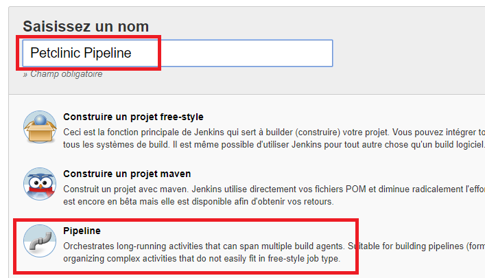
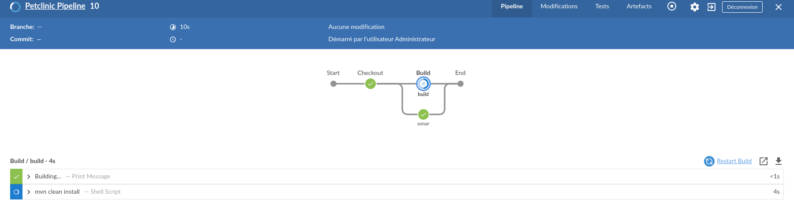

<center></center>

# Utilisation d'un Jenkinsfile
- Modifier le fichier Jenkinsfile de votre projet spring-framework-petclinic sous GitHub de la façon suivante :   
```groovy   
pipeline {  
    agent any  

    stages {  
        stage('Checkout') {  
            steps {  
                echo 'Checkout...'  
                git 'https://github.com/XXXXXX/spring-framework-petclinic.git' 
                
            }  
        }  
        stage('Build') {  
            steps {  
                parallel(  
                  build: {  
                    echo 'Building...'  
                    sh 'mvn clean package'  
                    archiveArtifacts 'target/*.war'  
                  },  
                  sonar: {  
                    echo "Analyse Sonar..."  
                  }  
                )                 
            }  
            
        }  
        stage('Deploy') {  
            steps {  
                echo 'Deploying...'  
                sh 'cp target/*.war /var/tmp'  
            }  
        }  
    }  
}  
```   

- Remplacer XXXXXX dans l'URL Git par votre compte GitHub
> Pour plus d'informations sur la construction du Jenkinsfile, aller à l'adresse suivante : [https://jenkins.io/doc/book/pipeline/jenkinsfile/](https://jenkins.io/doc/book/pipeline/jenkinsfile/)

## Création de l'item Petclinic_pipeline
- Description : cet item va récupérer automatiquement le Jenkinsfile à la racine du projet et va permettre de lancer les différentes tâches pour le déploiement.
- Nom : Petclinic_deployQualification
- Type : Pipeline



- Déclarer un pipeline avec la définition "**Pipeline script from SCM**"  
- Choisir le SCM "**Git**" et renseigner les informations du repository


- Ouvrir le pipeline avec "**Open Blue Ocean**"

<center></center>

 - Lancer le build  
 
<center></center>

 - Build en cours de construction :  

<center></center>

 - Fin de la construction :  

<center></center>

