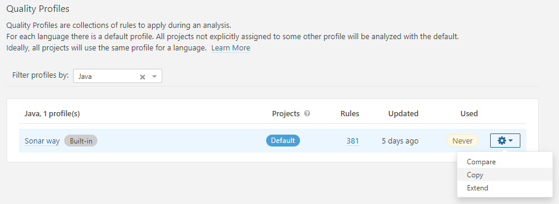
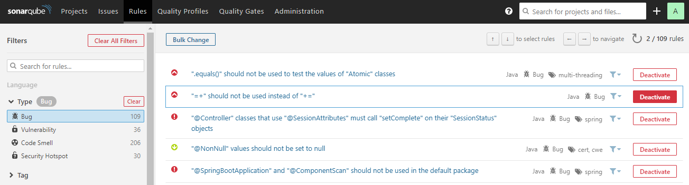

# Quality Profiles
But : Ajouter un nouveau profil "**Java**" qui est une copie du profil "**Sonar Way**" mais qui contient des règles en moins.   

- Ouvrir le menu "**Quality profiles**"  
- Filtrer sur le profil "**Java**"   
- Faire une copie du profil "**Sonar way**" et la nommer "**Petclinic**"

- Afficher la liste des règles de type "**Bugs**"
- Désactiver la règle que vous avez utilisé dans le TP précedent

- Définir ce nouveau profil Java comme profil par défaut
- Relancer une analyse Sonar, que se passe-t-il ?

# Quality Gates