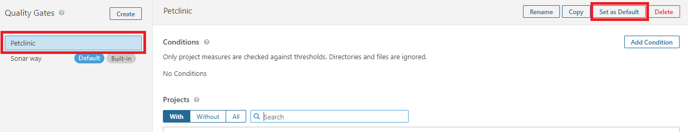
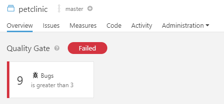
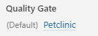

<center></center>

# Solution [[Version PDF]](pdf/SONAR1_solution.md.pdf "Ouvrir la version PDF")

# Quality Profiles
But : Ajouter un nouveau profil "**Java**" qui est une copie du profil "**Sonar Way**" mais qui contient moins de règles.   

- Ouvrir le menu "**Quality profiles**"  
- Filtrer sur le profil "**Java**"   
- Faire une copie du profil "**Sonar way**" et la nommer "**Petclinic**"

<center></center>

- Afficher la liste des règles de type "**Bugs**"
- Désactiver la règle que vous avez utilisé dans le TP précedent

<center></center>

- Définir ce nouveau profil Java comme profil par défaut


- Relancer une analyse Sonar  
```
mvn clean verify sonar:sonar -Dsonar.host.url=http://<IP_SERVEUR_SONAR>:9000
```
- Vérifier que le bon "**Quality profil**" a été utilisé :

<center></center>

- Que se passe-t-il au niveau du nombre de bugs ?  
	- Le nombre de bugs à diminué


# Quality Gates
But : Ajouter une condition pour faire échouer le résultat de l'analyse Sonar.   
- Ouvrir le menu "**Quality Gates**"  
- Créer une nouvelle "**Quality Gate**" et la nommer "**Petclinic**"  


- La positionner par défaut  


- Ajouter une condition avec la métrique "**Reliability/Bugs**" et positionner la valeur "**Error**" à 3  

 

- Relancer une analyse Sonar  
```
mvn clean verify sonar:sonar -Dsonar.host.url=http://<IP_SERVEUR_SONAR>:9000
```

- Vérifier que l'analyse est en bien à l'état "**Failed**"

<center></center> 
 
- Vérifier que le bon "**Quality gate**" a été utilisé :  

<center></center>  

