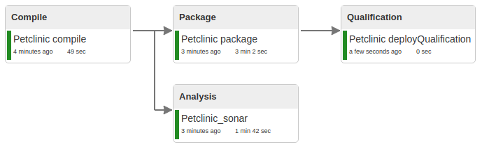
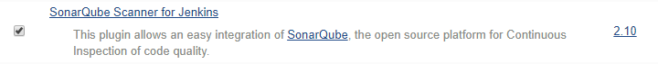
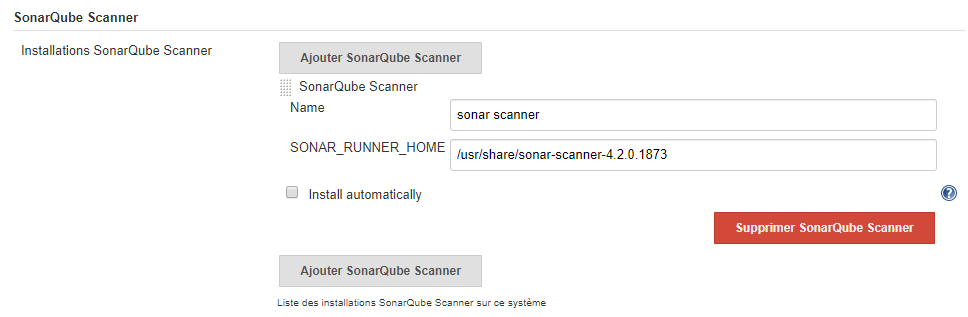
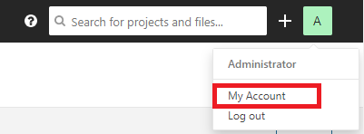
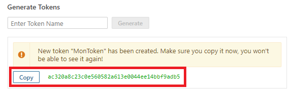
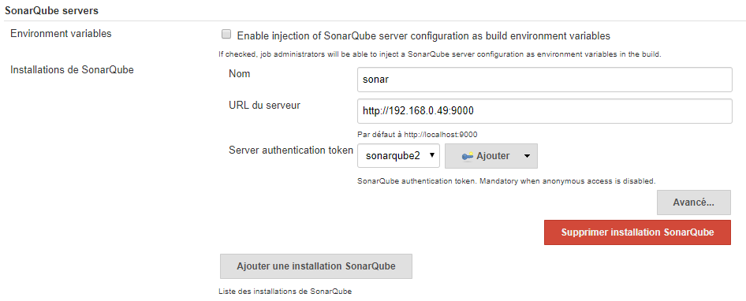
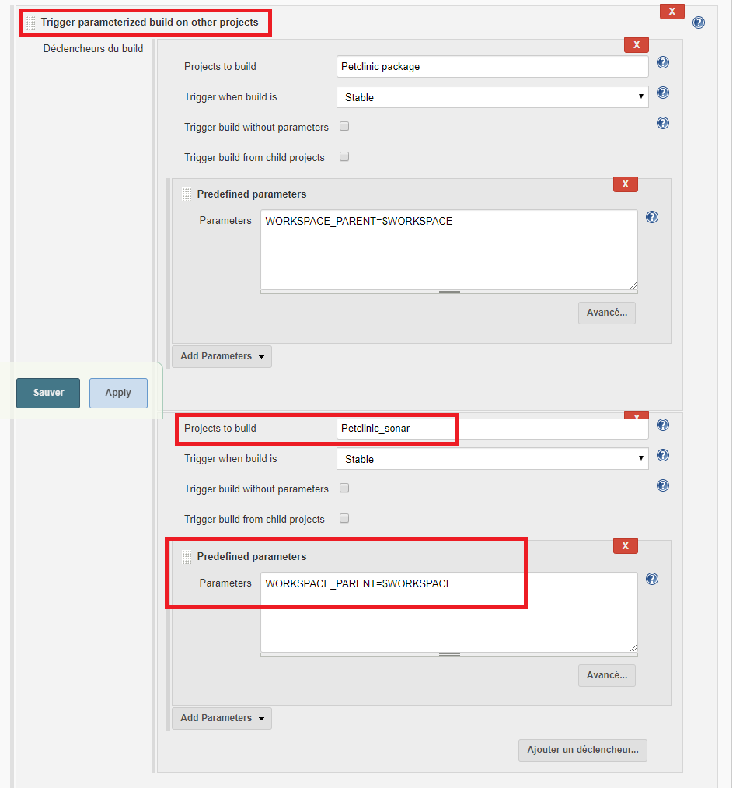

<center></center>

# Intégration dans Jenkins
But : Ajouter un item d'analyse Sonar en parallèle de l'item "**Petclinic_package**"  
<center></center>

## Installation du plugin Sonar Scanner
- Installer le plugin "**SonarQube Scanner**" (sans redémarrage)  

  

- Configurer le plugin dans la section "**Administrer Jenkins > Configuration globale des outils > SonarQube Scanner**" (*décocher Install automatically*)  
	- Name : SonarScanner  
	- SONAR\_RUNNER\_HOME : /usr/share/sonar-scanner-4.2.0.1873  
	
	
- Dans **Sonarqube** :  
	-  Aller dans le menu "**Administration > Configuration > Webhooks**"  
	
	  
	
	-  Créer un webhook avec les informations suivantes :  
		- Name : Jenkins  
		- URL : http://[IP\_SERVEUR\_JENKINS]:8080/sonarqube-webhook  
		- Secret : laisser vide  
		
		
		
	- Aller dans le menu "**My account > Security**" et générer un token. 
	
	  
	
	  
	
	**/!\\ ATTENTION /!\\** : copier le token généré pour ne pas le perdre, il sera impossible de le récupérer lorsque la page sera rechargée  
	  
- Dans **Jenkins** :  
	- Configurer le server Sonarqube dans "**Administrer Jenkins > Configurer le système > SonarQube servers**" :  
		- Nom : sonar  
		- URL du serveur : http://[IP\_SERVEUR\_SONAR]:9000  
		- Server authentication token : Ajouter un credential de type "**Secret text**" et coller le token créé précedement dans Sonarqube    
		

## Création de l'item Petclinic_sonar dans Jenkins  
- Nom : Petclinic_sonar  
- Type : Projet free-style  
- Paramètre string : WORKSPACE\_PARENT  
- Actions :  
1. Prends en paramètre le workspace du build parent (WORKSPACE\_PARENT)  


2. Lance un build de type "**Lancer une analyse avec SonarQube Scanner**"    
	- Sélectionner le JDK "**java-1.8-openjdk**"  
	- Ajouter les propriétés suivantes :  
```
sonar.java.binaries=target/classes  
sonar.projectBaseDir=$WORKSPACE_PARENT  
```


3. Modifier l'item "**Petclinic\_compile**" pour pouvoir lancer l'item "**Petclinic\_sonar**" en parallèle de l'item "**Petclinic\_package**"  



- Lancer un build
