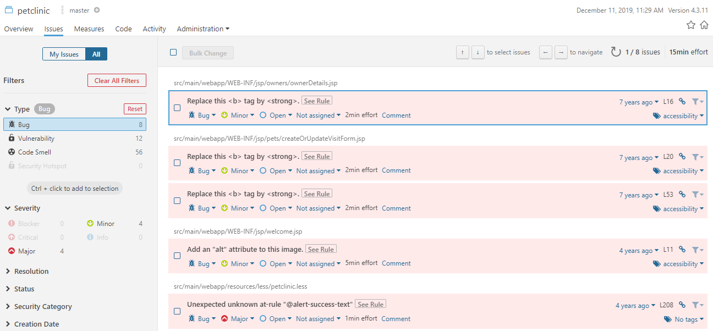

<center></center>

# Solution [[Version PDF]](pdf/SONAR_solution.md.pdf "Ouvrir la version PDF")

# Installation du docker
- Lancer le docker Sonarqube :   
```
docker run -d --name sonarqube -p 9000:9000 sonarqube
```
- Dans un navigateur, aller sur l'URL : [http://10.0.0.100:9000](http://10.0.0.100:9000)
- Se connecter avec le compte "admin" (mdp: admin)

# Analyse du projet spring-framework-petclinic

- Dans un terminal Ubuntu, se connecter sur le docker JenkinsCI avec la commande bash :  
```
docker exec -it JenkinsCI bash
``` 
- Se placer dans le répertoire "**/var/jenkins_home/workspace/Petclinic**"

```
cd /var/jenkins_home/workspace/Petclinic
```

- Si le répertoire est vide, récupérer les sources du projet spring-framework-petclinic (remplacer XXXXXXX par votre compte GitHub) :  

```
git clone https://github.com/XXXXXXX/spring-framework-petclinic.git
```

- Lancer une analyse sonar :   
```
mvn clean verify sonar:sonar -Dsonar.host.url=http://10.0.0.100:9000
```

- Consulter les résultats sur Sonarqube :


- Consulter la liste des bugs :



----------
# Correction d'un bug

- Dans Sonarqube, consulter le 1er bug rencontré dans le fichier "**src/main/webapp/WEB-INF/jsp/owners/ownerDetails.jsp**"
- Corriger ce bug dans le projet spring-framework-petclinic dans GitHub et faire un commit de la correction
- Relancer une analyse Sonar :
```
mvn clean verify sonar:sonar -Dsonar.host.url=http://10.0.0.100:9000
```
- Vérifier que le bug a bien disparu dans l'analyse

# Ajout d'un nouveau bug
- A partir du menu "**Rules**", sélectionner une règle de type "**Bug**" dans le langage "**Java**"  
- Copier la partie "**Noncompliant Code Example**" de cette règle et coller les lignes dans un fichier source Java du projet spring-framework-petclinic  


- Relancer une analyse Sonar :  
```
mvn clean verify sonar:sonar -Dsonar.host.url=http://10.0.0.100:9000  
```
- Vérifier que votre nouveau bug est bien remonté dans l'analyse Sonar
  

----------

